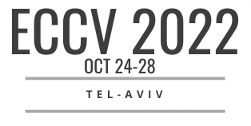
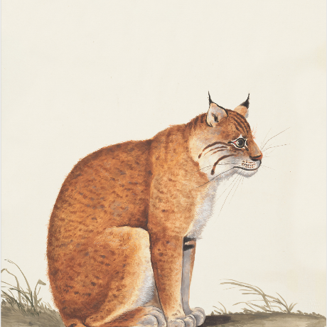
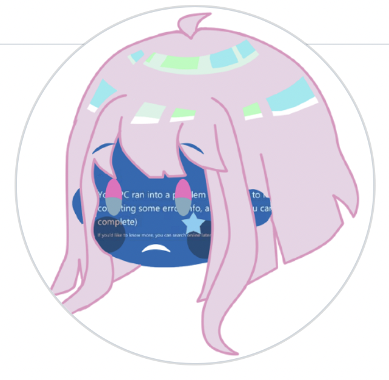
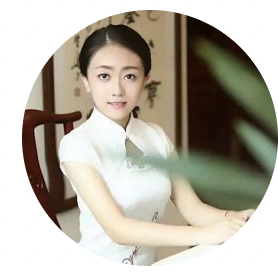

<h1 align="center"> Top-Conference-WeChat-Group</h1>

---

##  动机

为了帮助投稿顶会的同学进行交流，我们组织相应的顶会**交流群**供大家进行交流讨论，本仓库记录了相应**群规定和管理员信息**，为了更好，更公开的给大家提供帮助。  

管理员会为大家**按时更新所有AI顶会的截稿日期（管理员会在群内提前3个月，提前1个月分别提醒）。**

在该会议公布录取结果之后，我们还组织了**上岸群**帮助大家交流论文录取后的一些问题。放到QA公开文档中。

希望所有投稿的同学都好运！每投每中！

##  交流群/上岸群群规

> 点击对应群管理员的头像，即可获得微信。

扫描对应顶会交流群/上岸群管理员微信二维码，备注自己想要加入的顶会+交流/上岸，即可被拉入群聊。
**请各位同学入群后备注改为姓名+学校+方向**，我们会定期移除没有实名的同学。
群里交流的一些【注意事项】希望大家一起维护（违反会被移除群聊）：
- 1、**禁止透露任何个人投稿信息!!!** 包括但不限于投稿ID，投稿文章相关idea方向等
- 2、**禁止群里审稿人，领域主席等泄露审稿这些可能影响双盲的信息!!!**
- 3、**禁止群里同学大量加群里同学!!！** 不要影响其他同学!!! 该群仅用于投稿交流。
- 4、**未经同意禁止发布任何广告信息。** 招聘或者招生等信息可以联系群管理员由相应管理员发布
- 5、**添加相应管理员时备注好姓名+学校+方向，方便快速通过**

##  群信息

| 顶会会议                                                         | 截稿日期                                                                                                         | 交流群管理员微信                                                                                                     |上岸群管理员微信                    | QA文档
| :----------------------------------------------------------- | :----------------------------------------------------------- | :------------------------------------------------------------ | :----------------------------------------------------------- | :----------------------------------------------------------- |
|  | Deadline: Nov 18 2021 11:59:00 Pacific Time |<a href="https://github.com/MLNLP-World/Top-Conference-WeChat-Group/blob/main/imgs/weixin/yongfei.png"> 上海科技大学 刘永飞  
  
 </a>| <a href="https://github.com/MLNLP-World/Top-Conference-WeChat-Group/blob/main/imgs/weixin/yongfei.png"> 上海科技大学 刘永飞  
  
 </a> |
|  | Deadline: Mar 08 2022 04:59:00 GMT+0800 |<a href="https://github.com/MLNLP-World/Top-Conference-WeChat-Group/blob/main/imgs/weixin/yongfei.png"> 上海科技大学 刘永飞  
  
 </a> |  |

##  组织者
感谢以下同学对本项目进行组织
  
 
 
 
 
 
 

##  贡献者
感谢以下同学对本项目的支持与贡献

 
 
 
 
 
 

