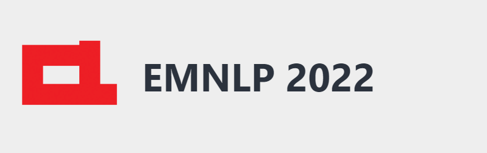
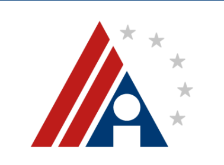
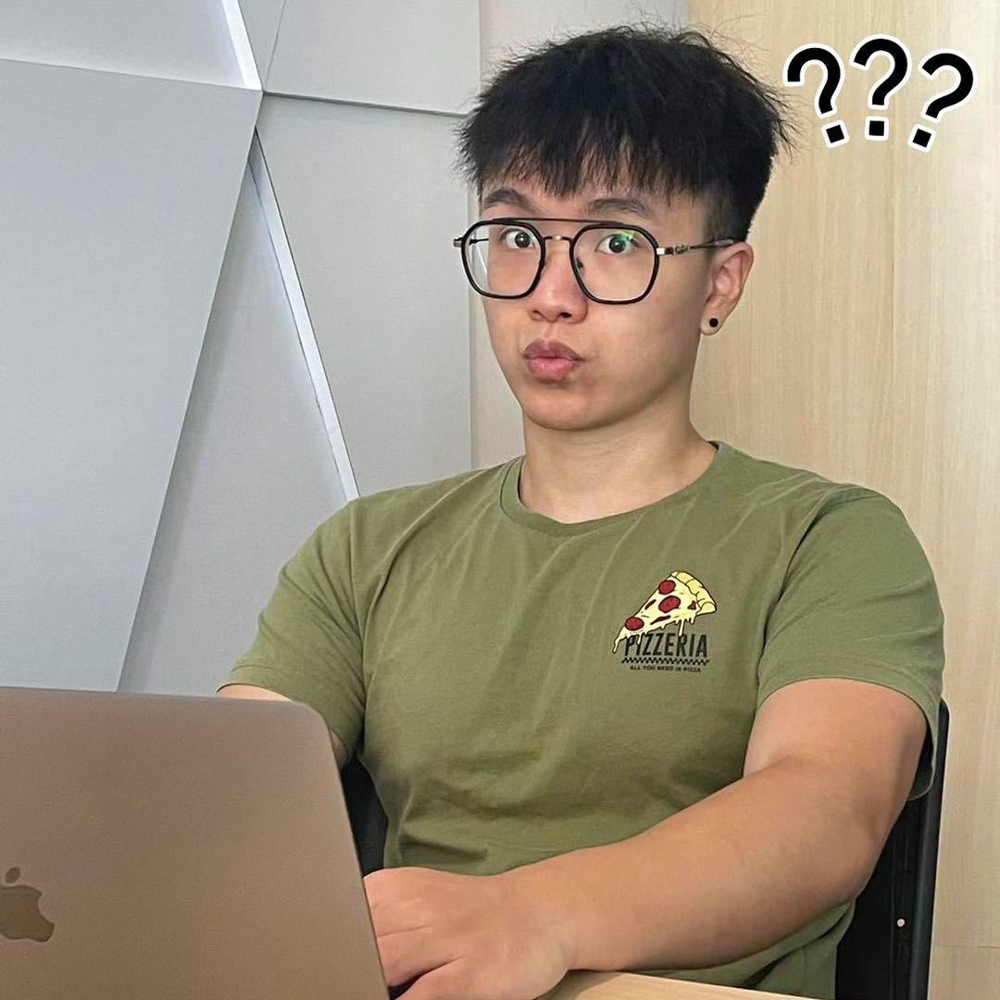

<h1 align="center"> Top-Conference-WeChat-Group</h1>

---

##  动机

为了帮助投稿顶会的同学进行交流，我们组织相应的顶会**交流群**供大家进行交流讨论，本仓库记录了相应**群规定和管理员信息**，为了更好，更公开的给大家提供帮助。

管理员会为大家**按时更新所有AI顶会的截稿日期（管理员会在群内提前3个月，提前1个月分别提醒）。**

在该会议公布录取结果之后，我们还组织了**上岸群**帮助大家交流论文录取后的一些问题。放到QA公开文档中。

希望所有投稿的同学都好运！每投每中！

##  交流群/上岸群群规

> 点击对应群管理员的头像，即可获得微信。

扫描对应顶会交流群/上岸群管理员微信二维码，备注自己想要加入的顶会+交流/上岸，即可被拉入群聊。
**请各位同学入群后备注改为姓名+学校+方向**，我们会定期移除没有实名的同学。
群里交流的一些【注意事项】希望大家一起维护（违反会被移除群聊）：

- 1、**禁止透露任何个人投稿信息!!!** 包括但不限于投稿ID，投稿文章相关idea方向等
- 2、**禁止群里审稿人，领域主席等泄露审稿这些可能影响双盲的信息!!!**
- 3、**禁止群里同学大量加群里同学!!!** 不要影响其他同学!!! 该群仅用于投稿交流。
- 4、**未经同意禁止发布任何广告信息。** 招聘或者招生等信息可以联系群管理员由相应管理员发布
- 5、**添加相应管理员时备注好姓名 + 学校 + 方向，方便快速通过**

##  群信息

| **链接**                                                     | **会议**    | **截稿日期**                                                 | **交流群管理员微信**                                         | **上岸群管理员微信**                                         | **QA文档**                                                   |
| :----------------------------------------------------------- | ----------- | :----------------------------------------------------------- | :----------------------------------------------------------- | :----------------------------------------------------------- | :----------------------------------------------------------- |
|  | WSDM 23'     | Deadline: August 12th, 2022 Anywhere on Earth             | <a href="https://pica.zhimg.com/80/v2-44bef2b640d9ae21d8f317bfa007e570_720w.jpeg"> 密歇根州立大学 毛海涛  
  
 </a> |                                                              |                                                              |
|  | LOG 22'     | Deadline: September 16th, 2022 Anywhere on Earth             | <a href="https://pica.zhimg.com/80/v2-44bef2b640d9ae21d8f317bfa007e570_720w.jpeg"> 电子科技大学 毛海涛  
  
 </a> |                                                              |                                                              |
|  | CVPR 22'    | Deadline: Nov 18 2021 11:59:00 Pacific Time                  | <a href="https://github.com/MLNLP-World/Top-Conference-WeChat-Group/blob/main/imgs/weixin/yongfei.png"> 上海科技大学 刘永飞  
  
 </a> | <a href="https://github.com/MLNLP-World/Top-Conference-WeChat-Group/blob/main/imgs/weixin/yongfei.png"> 上海科技大学 刘永飞  
  
 </a> |                                                              |
|  | ECCV 22'    | Deadline: Mar 08 2022 04:59:00 GMT+0800                      | <a href="https://github.com/MLNLP-World/Top-Conference-WeChat-Group/blob/main/imgs/weixin/yongfei.png"> 上海科技大学 刘永飞  
  
 </a> |                                                              |                                                              |
|  | EMNLP 22'   | ARR Deadline: July 24, 2022  Direct  Deadline: June 24, 2022  All deadlines are 11.59 pm  AOE | <a href="https://github.com/MLNLP-World/Top-Conference-WeChat-Group/blob/main/imgs/weixin/ensheng.png"> 西安交通大学 石恩升  
  
 </a> |                                                              |                                                              |
|  | CIKM 22'    | Deadline: May 09, 2022 23:59:00 Anywhere on Earth            | <a href="https://pica.zhimg.com/80/v2-44bef2b640d9ae21d8f317bfa007e570_720w.jpeg"> 电子科技大学 毛海涛  
  
 </a> |                                                              |                                                              |
|  | NeurIPS 22' | Deadline: Thursday, May 19, 2022 01:00 PM PDT                | <a href="https://pica.zhimg.com/80/v2-44bef2b640d9ae21d8f317bfa007e570_720w.jpeg"> 电子科技大学 毛海涛  
  
 </a> |                                                              |                                                              |
|  | COLING 22'  | Deadline: May 17, 2022 11:59 PM UTC-12:00                    | <a href="https://github.com/MLNLP-World/Top-Conference-WeChat-Group/blob/main/imgs/weixin/yiheng.jpg "> 南京大学 舒意恒 
 
 </a> |  <a href="https://github.com/MLNLP-World/Top-Conference-WeChat-Group/blob/main/imgs/weixin/yiheng.jpg "> 南京大学 舒意恒 
 
 </a>  | <a href="https://docs.qq.com/doc/DVk1CTk11YnFBSkx3?u=5b6b4c72b14f4bf3938c5b94c8673e7f"> 文档</a> |
|  | AAAI 23'    | Abs Deadline: Aug. 8, 2022 11:59 PM UTC-12:00                | <a href="https://github.com/MLNLP-World/Top-Conference-WeChat-Group/blob/main/imgs/weixin/yiheng.jpg "> 南京大学 舒意恒 
 
 </a> |                                                              |                                                              |
|  | ICLR 23'    | Deadline: Sep 29 2022 19:59:59 GMT+0800                | <a href="https://github.com/MLNLP-World/Top-Conference-WeChat-Group/blob/main/imgs/weixin/jinjie.jpg "> 南洋理工大学 倪瑾杰 
 
 </a> |                                                              |                                                              |

##  会议截止时间

- [Conference List](http://www.conferencelist.info/upcoming.html)
- [AI Conference Deadlines](https://aideadlin.es/?sub=ML,CV,CG,NLP,RO,SP,DM)
- [CCF Conference Deadlines](https://ccfddl.github.io)

##  组织者

感谢以下同学对本项目进行组织

##  贡献者

感谢以下同学对本项目的支持与贡献

