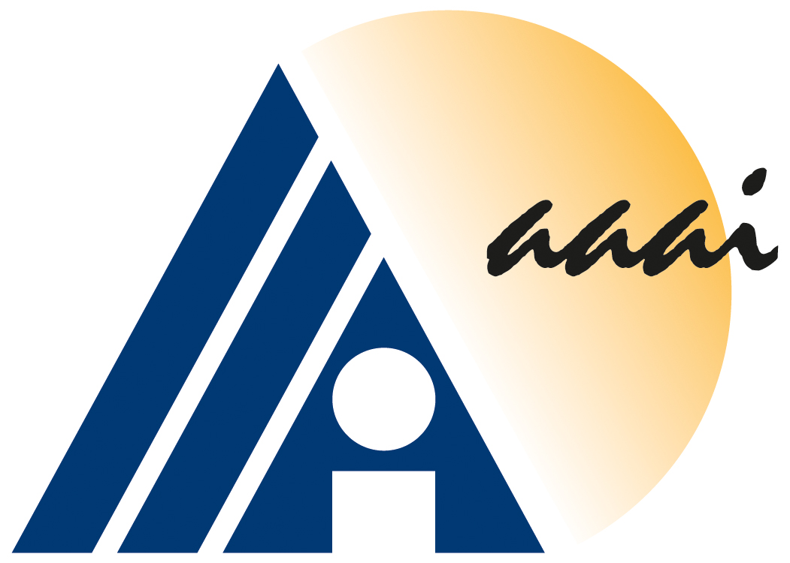

# Top-Conference-WeChat-Group

*AI 顶会交流群 · 信息同步 · 投稿经验分享 · 学术交流*

  
  
  

  <a href="#-动机">🎯 动机</a>
  &nbsp;·&nbsp;
  <a href="#-群规">📋 群规</a>
  &nbsp;·&nbsp;
  <a href="#-群信息">📊 群信息</a>
  &nbsp;·&nbsp;
  <a href="#-截稿日期">📅 截稿日期</a>
  &nbsp;·&nbsp;
  <a href="#-组织者">👥 组织者</a>
  &nbsp;·&nbsp;
  <a href="#-贡献者">💖 贡献者</a>

## 🎯 动机

> 为了帮助投稿顶会的同学进行交流，我们组织相应的顶会 **交流群** 供大家进行交流讨论。本仓库记录了相应的 **群规定和管理员信息**，旨在更好、更公开地给大家提供帮助。

- ⏰ 管理员会为大家 **按时更新所有 AI 顶会的截稿日期**（群内提前 **3 个月**、**1 个月** 分别提醒）
- 🎓 会议公布录取结果后，我们还组织了 **上岸群** 帮助大家交流论文录取后的相关问题，并同步到 QA 公开文档中

<b>🍀 希望所有投稿的同学都好运！每投每中！</b>

## 📋 群规

MLNLP 顶会交流群旨在提供高质量的顶会信息同步、投稿经验交流和学术资源分享平台。

> [!IMPORTANT]
> **📝 入群方式：** 扫描对应顶会交流群/上岸群管理员微信二维码，申请入群请备注 `姓名 + 学校/单位 + 方向 + 顶会 + 交流/上岸`，入群后请将群昵称修改为 `姓名 + 学校/单位 + 方向`，我们会定期移除没有实名的同学。

### ⚠️ 注意事项

> [!WARNING]
> 以下行为违反者将被移出群聊，请大家共同维护良好的交流环境。

| | 规则 |
|---|---|
| ✅ | 鼓励分享顶会重要时间节点、会议动态和投稿经验等内容 |
| 🚫 | 禁止发布广告、营销、刷屏、无关推广、低质量灌水、引战、人身攻击或不友善言论 |
| 🚫 | 禁止透露任何个人投稿信息，包括投稿 ID、匿名论文标题、投稿截图及其他未公开投稿内容 |
| 🚫 | 禁止讨论、猜测或传播任何可能违反双盲审稿、匿名投稿和会议保密要求的信息 |
| 🚫 | 审稿人、AC、领域主席等相关人员不得泄露审稿内容、评分、讨论、决策或任何会议内部保密信息 |
| 🚫 | 未经允许，禁止公开他人论文、投稿材料、审稿意见、聊天截图或个人信息，也请勿大量添加群内成员 |
| 📢 | 招聘、招生、活动和课程等信息需经管理员审核后发布；严重违反规则者将被移出群聊 |

## 📊 群信息

> [!NOTE]
> 标注为 **TBD** 的栏目表示该会议尚未公布相关时间节点，请持续关注官方通知。

| 会议名称 | 年份 | 官网 | 投稿截止 | Rebuttal | 结果通知 | CR 截止 | 交流群 | 上岸群 | 管理员 |
|---|---|---|---|---|---|---|---|---|---|
|  **AAAI** | 2027 | [AAAI-27](https://aaai.org/conference/aaai/aaai-27/) | 2026-07-28 23:59 UTC-12 | 2026-10-19 | 2026-11-30 | 2026-12-14 | [📷](./imgs/weixin/aaai/aaai-2027-discussion-group-20260704.jpg) | TBD | [📷](./imgs/weixin/aaai/AAAI-2027-admin.jpg) |
|  **ICLR** | 2027 | TBD | TBD | TBD | TBD | TBD | [📷](./imgs/weixin/iclr/iclr-2027-discussion-group-20260704.jpg) | TBD | [📷](./imgs/weixin/iclr/ICLR-2027-admin.jpg) |
|  **NAACL** | 2027 | TBD | TBD | TBD | TBD | TBD | TBD | TBD | TBD |
|  **ACL** | 2027 | TBD | TBD | TBD | TBD | TBD | TBD | TBD | TBD |
|  **ICML** | 2027 | TBD | TBD | TBD | TBD | TBD | TBD | TBD | TBD |
|  **IJCAI** | 2027 | TBD | TBD | TBD | TBD | TBD | TBD | TBD | TBD |
|  **COLING** | 2027 | TBD | TBD | TBD | TBD | TBD | TBD | TBD | TBD |
|  **ACM MM** | 2027 | TBD | TBD | TBD | TBD | TBD | TBD | TBD | TBD |
|  **EMNLP** | 2027 | TBD | TBD | TBD | TBD | TBD | TBD | TBD | TBD |
|  **NeurIPS** | 2027 | TBD | TBD | TBD | TBD | TBD | TBD | TBD | TBD |

## 📅 截稿日期

> [!TIP]
> 以下为常用的学术会议截稿日期查询平台，建议收藏以便随时查阅。

| 资源 | 说明 |
|---|---|
| [📋 Conference List](http://www.conferencelist.info/upcoming.html) | 综合学术会议列表 |
| [🤖 AI Conference Deadlines](https://aideadlin.es/?sub=ML,CV,CG,NLP,RO,SP,DM) | AI 领域会议截止时间汇总 |
| [🏛️ CCF Conference Deadlines](https://ccfddl.github.io) | CCF 推荐会议截止时间 |

## 👥 组织者

## 💖 贡献者

  📮 如有问题欢迎提 <a href="https://github.com/MLNLP-World/Top-Conference-WeChat-Group/issues">Issue</a> 或 <a href="https://github.com/MLNLP-World/Top-Conference-WeChat-Group/pulls">PR</a> | ⭐ 如果对你有帮助，欢迎 Star

